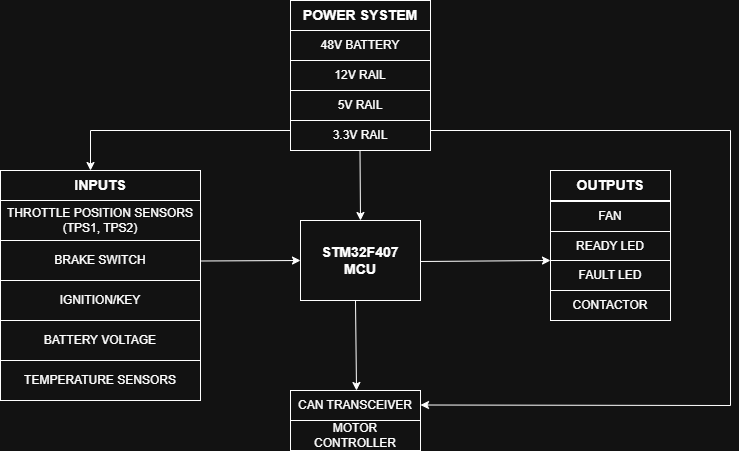

# System Architecture – EV VCU

## 1. System Overview

The Vehicle Control Unit (VCU) is a central controller for a 48V electric vehicle system. It reads sensor inputs, processes control logic, and controls outputs and communication over CAN.

---

## 2. Block Diagram

---

## 3. System Blocks

### Power System

* Converts 48V battery into 12V, 5V, and 3.3V rails
* 3.3V powers STM32 and sensors

### MCU (STM32F407)

* Central controller
* Reads sensors
* Executes control and safety logic
* Sends CAN messages

### Inputs

* Dual throttle sensors (TPS1, TPS2)
* Brake switch
* Ignition signal
* Battery voltage and temperature sensors

### Outputs

* Cooling fan control
* Main contactor control
* Ready and Fault LEDs

### Communication

* CAN bus interface using external transceiver
* Communicates with motor controller and other ECUs

---

## 4. Signal Flow

Sensor inputs → STM32 ADC/GPIO → Processing → Outputs/CAN

---

## 5. Power Flow

48V Battery → DC-DC Converters → 3.3V → STM32 + sensors

---

## 6. System Scope

The VCU does not directly control the motor. It communicates with the motor controller via CAN.
